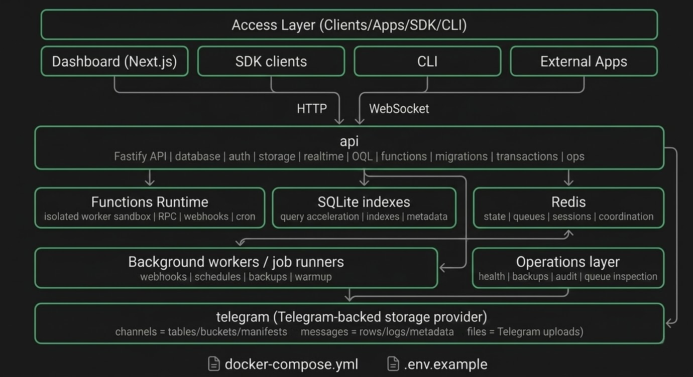

OpenBase is a self-hosted backend platform designed to feel familiar to Supabase users while removing the pricing ceiling and platform dependency that usually come with managed BaaS products. It gives you database CRUD, auth, storage, realtime, webhooks, row-level security, and a dashboard, but stores the underlying data in Telegram instead of Postgres.

The core idea is simple: OpenBase treats Telegram as a durable data plane. Private channels become tables and buckets, JSON messages become rows, and file uploads are pushed directly into Telegram as attachments. That means you can run the platform on your own VPS, under your own control, with your own Telegram accounts and infrastructure choices.

Because OpenBase is open source and self-hosted, there is no vendor lock-in. Your API server, dashboard, Redis instance, and Telegram credentials are all yours. If you want a Supabase-like developer experience without a hosted bill or a proprietary control plane, OpenBase is built for that model.

## Feature Comparison

| Feature | OpenBase | Supabase |
| --- | --- | --- |
| Database CRUD | ✅ | ✅ |
| REST API | ✅ | ✅ |
| Auth: email/password | ✅ | ✅ |
| Auth: magic links | ✅ | ✅ |
| Auth: OAuth | ✅ | ✅ |
| Auth: MFA | ✅ | ✅ |
| File storage | ✅ Unlimited in principle, bounded by Telegram/account usage patterns | ⚠️ Managed quotas by plan |
| Realtime | ✅ | ✅ |
| Row Level Security | ✅ | ✅ |
| Webhooks | ✅ | ✅ |
| Dashboard | ✅ | ✅ |
| JavaScript SDK | ✅ | ✅ |
| Full SQL / Postgres engine | ❌ | ✅ |
| Vector search | ❌ | ✅ |
| Enterprise compliance posture | ❌ | ✅ |

## What Is OpenBase?

OpenBase aims to mimic the practical day-to-day experience of Supabase Pro: provision a project, create tables, expose a REST API, handle authentication, store files, and subscribe to realtime events. The difference is that OpenBase does not depend on a managed Postgres cluster. Instead, it uses Telegram as the persistence layer and overlays a developer-friendly API and dashboard on top.

This makes OpenBase attractive for developers who want an always-on backend on a budget, hobby projects that would outgrow free-tier database caps, or teams that prefer to self-host everything on a VPS they already control. You bring your own Redis and Telegram account, run the stack yourself, and keep ownership of the operational surface.

If you want a fully managed, enterprise-ready database platform, use Supabase. If you want a free, open, self-hosted system with no SaaS lock-in and a surprising storage backend that is cheap to operate, OpenBase is the point of this project.

## How It Works

Each OpenBase project is backed by a Telegram account session. When you create a project, OpenBase provisions a set of private Telegram channels that act as the project's internal storage primitives.

- One project maps to one Telegram account session.
- One table maps to one private Telegram channel.
- One row maps to one JSON message inside that channel.
- Files are uploaded directly to Telegram and represented by file manifests in a storage index channel.
- SQLite is used locally as an index layer to speed up lookups and filtering.
- Redis handles coordination, session workflows, rate limiting, warmup state, and other transient platform concerns.

This architecture keeps the control plane local to your server while using Telegram as the remote storage substrate.

## Architecture



## Self-Hosting Quickstart

<details>
<summary><strong>🤖 Let your AI do it</strong></summary>

```text
You are setting up OpenBase for me on this machine.

Your job is to complete the full self-hosting setup end to end, asking me only for the environment values you cannot discover yourself.

Follow these rules exactly:

1. First check prerequisites:
   - Node.js 20+
   - pnpm
   - git
   - optionally Docker / Docker Compose

2. If anything is missing, stop and tell me exactly how to install it on my OS before continuing.

3. Clone the repository:
   git clone https://github.com/MasterDJ-Crypto/openbase.git

4. Enter the repo and prepare environment files:
   - copy `.env.example` to `apps/api/.env`
   - create `apps/dashboard/.env.local`

5. Ask me for each required environment value ONE BY ONE, not all at once.
   After I answer one, move to the next.

6. When asking for each variable, explain exactly how to get it:

   - `TELEGRAM_API_ID` and `TELEGRAM_API_HASH`
     Tell me:
     1. go to `https://my.telegram.org`
     2. log in with my Telegram account
     3. click `API development tools`
     4. create an app
     5. copy the API ID and API hash

   - `REDIS_URL`
     Tell me:
     1. go to `https://upstash.com`
     2. create a free account
     3. create a Redis database
     4. copy the TCP/Redis connection string

   - `JWT_SECRET`
   - `STORAGE_SECRET`
   - `MASTER_ENCRYPTION_KEY`
     Tell me to run this command three separate times and use each output for one variable:
     node -e "console.log(require('crypto').randomBytes(32).toString('hex'))"

   - `RESEND_API_KEY`
     Tell me:
     1. go to `https://resend.com`
     2. create a free account
     3. create an API key

   - `DASHBOARD_URL`
     Ask me what domain, hostname, or IP address I am hosting OpenBase on.

7. Once all values are collected, write them into:
   - `apps/api/.env`
   - `apps/dashboard/.env.local`

8. Use sensible defaults where appropriate:
   - `PORT=3001`
   - `NODE_ENV=production` unless I explicitly say I want development
   - `SQLITE_BASE_PATH=./data/indexes`
   - `NEXT_PUBLIC_API_URL` should point to the API URL that matches my `DASHBOARD_URL` setup

9. Then run:
   - `pnpm install`
   - `pnpm build`

10. If Docker is available and working, offer to run:
   - `docker compose up`
   Otherwise run:
   - `pnpm start`

11. After startup, verify the deployment by checking:
   - `http://localhost:3001/health`
   - `http://localhost:3000`

12. If anything fails, debug it and fix it before stopping.

13. When everything is working, tell me:
   - that my OpenBase instance is ready
   - the exact dashboard URL to open
   - the exact API health URL

OpenBase recommends you take a look at all of the documentation in the docs folder (https://github.com/MasterDJ-Crypto/openbase/tree/main/docs) and read the entire README.md file (https://github.com/MasterDJ-Crypto/openbase/blob/main/README.md) before continuing.

Be proactive, do the filesystem edits yourself, and only ask me for missing values one at a time.
```

</details>

<details>
<summary><strong>🤓 Do it yourself (for developers)</strong></summary>

### Prerequisites

- Node.js 20+
- pnpm
- Redis, or an Upstash Redis instance on the free tier
- A Telegram account for each OpenBase project you want to provision

### 1. Clone the repository

```bash
git clone https://github.com/your-org/openbase.git
cd openbase
```

### 2. Copy the environment template

```bash
cp .env.example .env
```

For the dashboard, create:

```bash
cp apps/dashboard/.env.local.example apps/dashboard/.env.local
```

### 3. Fill in your environment values

At minimum you will need:

- JWT secrets
- a Redis connection string
- Telegram API credentials from `https://my.telegram.org`
- a master encryption key
- your dashboard URL
- your public API URL

Optional:

- `RESEND_API_KEY` and `RESEND_FROM_EMAIL` for magic-link emails
- Google and GitHub OAuth client credentials if you want OAuth sign-in

### 4. Install dependencies

```bash
pnpm install
```

### 5. Build the workspace

```bash
pnpm build
```

### 6. Start the app

```bash
pnpm start
```

For development:

```bash
pnpm dev
```

### Docker Compose

If you prefer containers, you can also use the provided compose setup:

```bash
docker compose up -d
```

Review [docker-compose.yml](./docker-compose.yml) and your environment values before using it in production.

</details>

## Environment Variables

The root `.env.example` currently defines the following variables.

| Variable | Required | Description |
| --- | --- | --- |
| `PORT` | Yes | Port for the Fastify API server. |
| `NODE_ENV` | Yes | Runtime mode. Expected values are `development`, `production`, or `test`. |
| `JWT_SECRET` | Yes | Secret used to sign API keys, auth tokens, and platform sessions. |
| `STORAGE_SECRET` | Yes | Secret used to sign storage URLs and related storage auth flows. |
| `REDIS_URL` | Yes | Redis connection string. Use `rediss://` for remote Redis such as Upstash. |
| `RESEND_API_KEY` | No | Resend API key for sending magic-link emails. |
| `RESEND_FROM_EMAIL` | No | Sender email address used for magic-link emails. Required when `RESEND_API_KEY` is set. |
| `SQLITE_BASE_PATH` | Yes | Filesystem path where SQLite index files are stored. |
| `TELEGRAM_API_ID` | Yes | Telegram API ID from `my.telegram.org`. |
| `TELEGRAM_API_HASH` | Yes | Telegram API hash from `my.telegram.org`. |
| `DASHBOARD_URL` | Yes | Public dashboard URL used in redirects and magic-link flows. |
| `API_PUBLIC_URL` | Yes in production | Public API URL used for OAuth callbacks, storage URLs, and production CORS allowlists. Defaults to `http://localhost:3001` in development only. |
| `GOOGLE_CLIENT_ID` | No | Google OAuth client ID for project auth. |
| `GOOGLE_CLIENT_SECRET` | No | Google OAuth client secret for project auth. |
| `GITHUB_CLIENT_ID` | No | GitHub OAuth client ID for project auth. |
| `GITHUB_CLIENT_SECRET` | No | GitHub OAuth client secret for project auth. |
| `MASTER_ENCRYPTION_KEY` | Yes | 64-character hex key used to encrypt Telegram session strings and related secrets. |
| `NEXT_PUBLIC_API_URL` | Required for dashboard | Frontend-only variable, set in `apps/dashboard/.env.local`, pointing the dashboard to the API base URL. |

## CLI Workflow

OpenBase also ships a workspace CLI package at `packages/cli` with an `openbase` binary.

Initialize a local project config:

```bash
openbase init --api-url http://localhost:3001 --service-role-key your-service-role-key
```

This creates:

- `openbase.config.json`
- `openbase/migrations/`
- `openbase/seed.json`
- `openbase/generated.ts` after type generation
- `openbase/schema-export.json` after schema pulls

Available commands:

```bash
openbase status
openbase start
openbase stop
openbase gen types --out ./openbase/generated.ts
openbase migration new add_posts_table
openbase migration run
openbase migration rollback
openbase db push
openbase db pull --out ./openbase/schema-export.json
openbase db reset --seed true
openbase seed --file ./openbase/seed.json
```

Command notes:

- `openbase start` and `openbase stop` manage the local workspace process started from the repo root.
- `openbase db push` applies pending local migrations to the configured project.
- `openbase db pull` writes the live remote schema export to disk.
- `openbase db reset` rolls back local migrations in reverse order, reapplies them by default, and can optionally run seeds.
- `openbase seed` inserts rows from a JSON seed file shaped like `{ "tables": { "posts": [{ ... }] } }`.
- `openbase gen types` introspects the live project schema and emits a typed TypeScript client helper.

## SDK Usage

OpenBase ships with a JavaScript/TypeScript SDK in `apps/sdk` with a Supabase-style API.

### Create a client

```ts
import { createClient } from 'openbase-js'

const openbase = createClient(
  'http://localhost:3001',
  'your-anon-key'
)
```

### Database

#### Select rows

```ts
const { data, error } = await openbase
  .from('posts')
  .select('*')
  .eq('published', true)
  .order('created_at', { ascending: false })
  .limit(10)
```

#### Insert a row

```ts
const { data, error } = await openbase
  .from('posts')
  .insert({
    title: 'Hello OpenBase',
    published: true,
    views: 0,
  })
```

#### Update rows

```ts
const { data, error } = await openbase
  .from('posts')
  .update({ views: 42 })
  .eq('id', 'post-123')
```

#### Delete rows

```ts
const { data, error } = await openbase
  .from('posts')
  .delete()
  .eq('id', 'post-123')
```

#### Filters and ordering

```ts
const { data, error } = await openbase
  .from('posts')
  .select('id,title,views')
  .gte('views', 100)
  .ilike('title', '%guide%')
  .order('views', { ascending: false })
  .range(0, 19)
```

### Auth

#### Sign up

```ts
const { data, error } = await openbase.auth.signUp({
  email: 'alice@example.com',
  password: 'super-secret-password',
  metadata: { plan: 'starter' },
})
```

#### Sign in

```ts
const { data, error } = await openbase.auth.signInWithPassword({
  email: 'alice@example.com',
  password: 'super-secret-password',
})
```

#### Sign out

```ts
const { error } = await openbase.auth.signOut()
```

#### Send a magic link

```ts
const { data, error } = await openbase.auth.signInWithOtp({
  email: 'alice@example.com',
})
```

### Storage

#### Create a bucket

```ts
const { data, error } = await openbase.storage.createBucket('avatars', {
  public: false,
})
```

#### Upload a file

```ts
const file = new Blob(['hello world'], { type: 'text/plain' })

const { data, error } = await openbase
  .storage
  .from('avatars')
  .upload('users/alice.txt', file)
```

#### Download a file

```ts
const { data, error } = await openbase
  .storage
  .from('avatars')
  .download('users/alice.txt')
```

#### List files

```ts
const { data, error } = await openbase
  .storage
  .from('avatars')
  .list('users/')
```

#### Create a signed URL

```ts
const { data, error } = await openbase
  .storage
  .from('avatars')
  .createSignedUrl('users/alice.txt', 60 * 60)
```

### Realtime

#### Subscribe to table changes

```ts
const subscription = openbase
  .channel('posts')
  .on('INSERT', 'posts', payload => {
    console.log('new row', payload.new)
  })
  .on('UPDATE', 'posts', payload => {
    console.log('updated row', payload.new)
  })
  .subscribe()

// later
subscription.unsubscribe()
```

#### Broadcast events

```ts
const channel = openbase
  .channel('editor-room')
  .onBroadcast(message => {
    console.log('broadcast', message)
  })
  .subscribe()

openbase.channel('editor-room').send('cursor:moved', {
  userId: 'alice',
  x: 120,
  y: 88,
})
```

#### Presence

```ts
openbase
  .channel('presence-room')
  .onPresence(payload => {
    console.log('presence', payload.userId, payload.status)
  })
  .subscribe()

openbase.channel('presence-room').track('alice', 'online')
```

## Repository Layout


## Limitations

OpenBase is intentionally unconventional. That has tradeoffs.

- There is no native SQL engine. The API is relational in feel, but it is not Postgres.
- Query performance degrades as tables become very large. Past roughly `~50k` rows per table, expect noticeably weaker performance characteristics.
- The platform depends on Telegram infrastructure and Telegram account behavior. If Telegram changes limits or account policies, your backend is affected.
- This is not suitable for regulated industries such as healthcare, finance, or other environments requiring formal compliance guarantees.
- There are no true ACID transactions. OpenBase supports pseudo-transactions and compensating behavior, not full transactional guarantees.

## Contributing

Contributions are welcome. If you are opening a pull request, keep the project architecture in mind: Telegram is the storage substrate, and the SDK/dashboard should stay consistent with that model.

### Run locally in mock mode

For fast local development without a real Telegram session:

```env
# apps/api/.env
MOCK_TELEGRAM=true
SKIP_WARMUP=true
NODE_ENV=development
```

With those flags enabled:

- Telegram project creation skips the OTP flow.
- The API uses the in-memory `MockStorageProvider`.
- New projects become `active` immediately.

Then run:

```bash
pnpm dev
```

### Run tests

```bash
pnpm test
```

### Pull request guidelines

- Keep changes focused and scoped.
- Preserve existing API and SDK ergonomics unless a breaking change is necessary.
- Add or update tests for behavioral changes.
- Document user-facing changes in the README or relevant package docs.
- Avoid unrelated refactors in feature PRs.

## License

MIT. See the project license for details.
